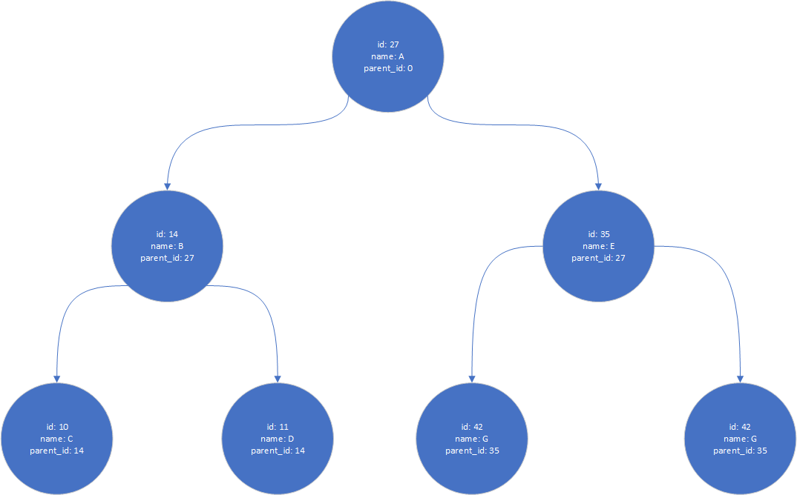
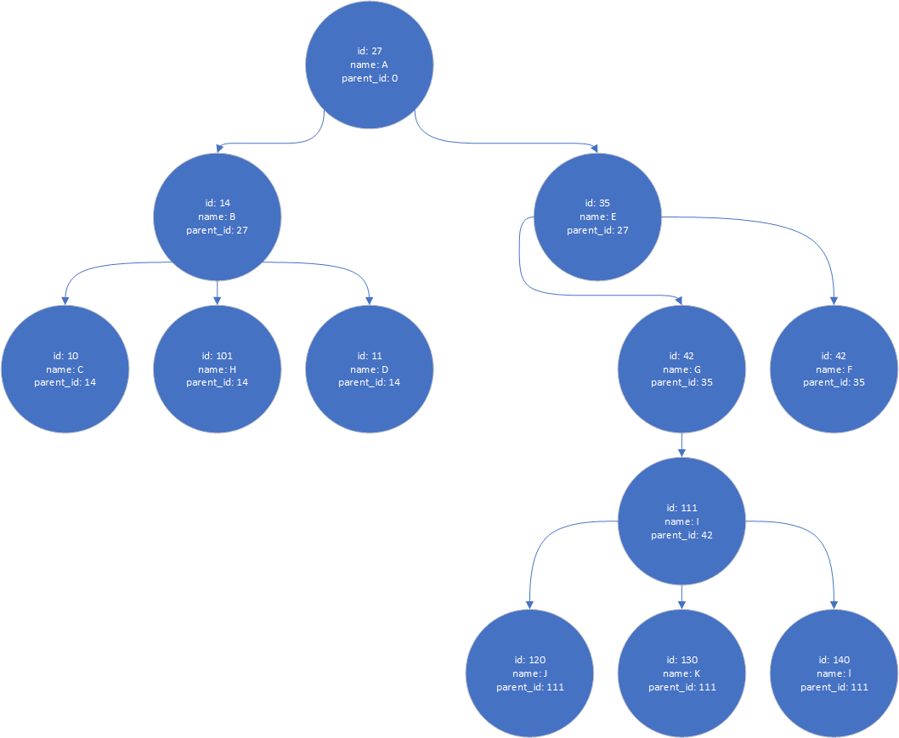

# Sort Categories For Insert

This repository is a solution for [This Coding Challenge](https://bitbucket.org/snippets/dbuy/rnB4an)

## Problem Analysis

The assignment specify an unsorted input array of Nodes which must be resorted in order to assure that a parent Node will be processed before its children.

For Example: Given the following Input
```JavaScript
[
  {
    "name": "Accessories",
    "id": 1,
    "parent_id": 20,
  },
  {
    "name": "Watches",
    "id": 57,
    "parent_id": 1
  },
  {
    "name": "Men",
    "id": 20,
    "parent_id": null,
  }
]
```

The Following Tree Will be processes as output


* The solution Assumed either the input of Stringified JSON object or a JSON object itself.
* The Output is a JSON String as per Request 

## Big O Analysis
The Solution consists of two loops O(n)+O(n) = O(n)

Using the measured time of execution for different input arrays size it is possible to confirm the analysis.


## Test Cases (MOCHA)
By Running yarn test we visit the following test cases.


### Beside the Original Provided example The following cases have been tested:
* ### Missing parent_id property case
* ### Binary Tree

* ### Non-Binary Tree

* ### Multiple Trees BitBucket + non Binary Tree
* ### Tens of thousands Random Trees input

Please note that no effort has been made to optimize the following Validation:
```JavaScript
it('Should have the parent node inserted before current node ( a child category cannot be inserted before its parent category)', function () {
      let Inserted_IDs = [];
      result.forEach(input => {   //Loop Result Array
        assert.equal((Inserted_IDs.indexOf(input.parent_id) >= 0) || input.parent_id === null, true); //Check if current is root or has parent inserted
        Inserted_IDs.push(input.id);
      })
    });
```

## References Used

YouTube refreshment for Tree Structures  ¯\\\__(ツ)\__/¯

[Data Structures: Trees](https://www.youtube.com/watch?v=oSWTXtMglKE&ab_channel=HackerRank)

[Pre-order tree traversal](https://www.youtube.com/watch?v=1WxLM2hwL-U&ab_channel=MichaelSambol)
